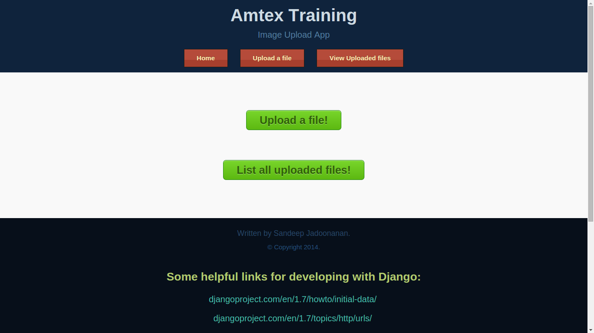
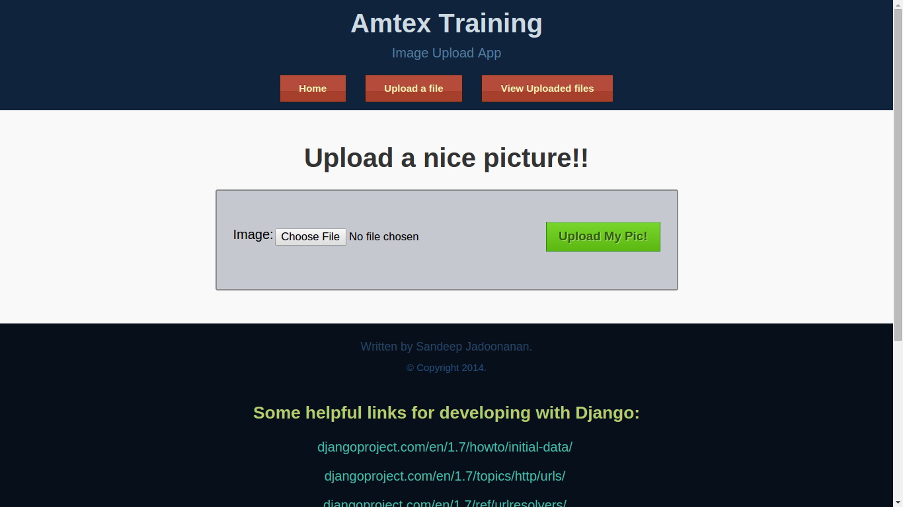
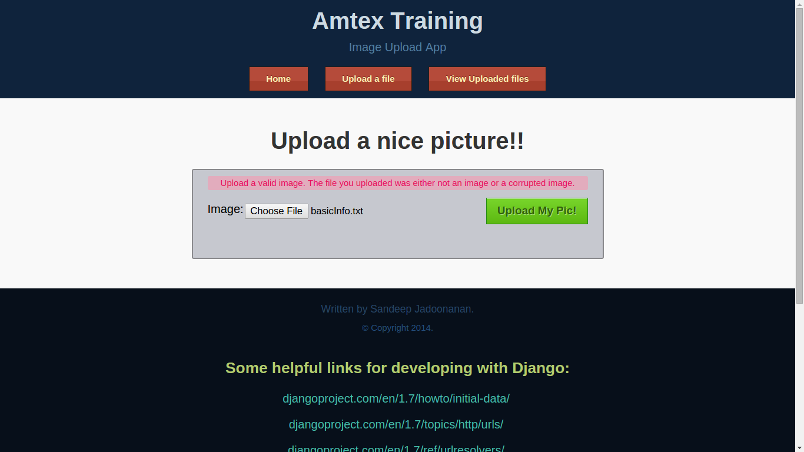
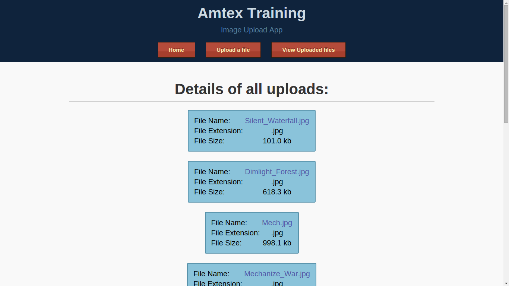

django-file-upload
==================

A simple Django app that uploads a file, and displays uploaded content.

Home Page

==================

Upload Form

==================

No Chosen Picture

==================

Wrong File Type

==================

Valid Image

==================

No Pictures have been uploaded

==================

File Details 1

==================

File Details 2

==================

